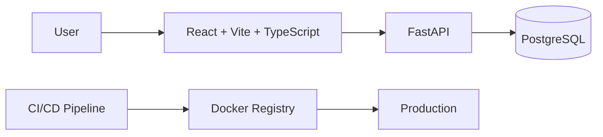

# Movie Recommender


Full-stack movie recommendation web application: users browse and search movies, rate them, and get recommendations based on the genres, directors and cast of the movies they rated highly.

University project for the *Análise e Desenho de Software* course, Computer Engineering (LEI), University of Coimbra. <!-- TODO: confirm the course name (ADS) -->

<!-- TODO: add screenshots to docs/screenshots/ (home page, recommendations, movie detail) and reference them here -->

## Features

- Browse, search and filter movies by genre
- Movie details with cast
- User registration and login (JWT)
- Rate movies (create, update, delete) and list your own ratings
- Recommendations by genre, by director and by cast
- Database migrations (Alembic) and seed data
- Unit and endpoint tests for the API
- CI/CD pipeline (GitLab CI), documentation generated with MkDocs

## Architecture



The API follows a layered structure: routers → services → repositories → SQLAlchemy models. More detail in [`docs/content/ARCH`](docs/content/ARCH/architecture_diagrams.md) (C4 diagrams) and [`docs/content/ER`](docs/content/ER/conceptual_diagram.md) (conceptual ER diagram).

### Recommendations

All three recommenders exclude movies the user has already rated:

- **By genre:** takes the user's top 5 genres by average rating given, then orders unseen movies by that genre average and by the movie's own average rating
- **By director:** unseen movies from the directors of movies the user rated, ordered by average rating
- **By cast:** unseen movies with cast members from movies the user rated, ordered by average rating

<!-- TODO: describe the reasoning behind this approach (why content-based, limitations, alternatives considered) -->

## Tech Stack

- **Backend:** Python, FastAPI, SQLAlchemy, Alembic, PostgreSQL, JWT
- **Frontend:** React 19, TypeScript, Vite, Tailwind CSS
- **DevOps:** Docker, Docker Compose, GitLab CI, GitHub Actions, MkDocs

## Project Structure

| Path | Contents |
|---|---|
| `src/api` | FastAPI backend: models, schemas, repositories, services, routers, Alembic migrations, seed data and tests |
| `src/web` | React frontend |
| `docs` | MkDocs documentation: architecture (C4), ER diagrams and CI/CD |
| `ci` | GitLab CI job definitions, included from `.gitlab-ci.yml` |
| `REQS` | Requirements report |
| `docker-compose.yml` | Runs the database, the API and the frontend |

## Getting Started

### Prerequisites

- Docker and Docker Compose, or
- Python 3.13, Node.js 20 and PostgreSQL for a local setup

### Installation and usage

**With Docker (recommended)**

```bash
docker-compose up --build
```

| Service | URL |
|---|---|
| Frontend | http://localhost |
| API | http://localhost:5005 (interactive docs at `/docs`) |
| PostgreSQL | localhost:5433 |

Migrations run automatically on startup.

**Backend locally (no Docker)**

```bash
cd src/api
python -m venv .venv
source .venv/bin/activate
pip install -r requirements.txt
alembic upgrade head
python seed_data.py            # optional: sample data
uvicorn app.main:app --reload --host 0.0.0.0 --port 8000
```

Locally the API runs on port **8000** (set `DATABASE_URL` in the environment or in a `.env` file); with Docker it runs on **5005**.

**Frontend locally**

```bash
cd src/web
npm install
npm run dev
```

The API address is read from `src/web/public/config.js` (`API_URL`, default `http://localhost:5005`, so adjust it to `http://localhost:8000` when running the backend locally).

### Tests

```bash
cd src/api
pip install pytest pytest-cov
pytest
```

The tests use an in-memory SQLite database, so no PostgreSQL is needed.

## CI/CD

The original pipeline runs on GitLab CI (`.gitlab-ci.yml` and `ci/`) with these stages: static analysis (pylint, prettier), unit tests, build and push of the Docker images, container security scan (Trivy), documentation generation and deploy. See [`docs/content/CI_CD`](docs/content/CI_CD/pipeline.md).

On GitHub, `.github/workflows/ci.yml` runs the backend tests and the frontend lint and build.

<!-- TODO: add the link to the deployed app, if it is still online -->

## Authors

<!-- TODO: add the team members -->

University of Coimbra · Computer Engineering · 2025
