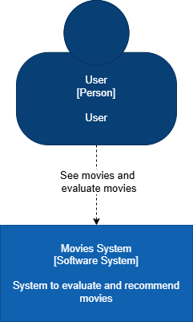
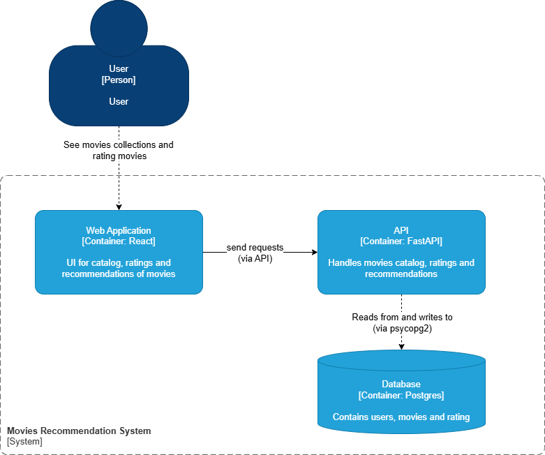

# Architecture Diagrams

This section provides a comprehensive view of the Movie Recommendation Platform architecture through C4 model diagrams. The C4 model is a lean graphical notation technique for modeling software architecture, helping to visualize the structure of software systems at different levels of abstraction.

## System Context Diagram

The System Context diagram provides a high-level view of how the Movie Recommendation Platform fits into the world around it. It shows the system's boundaries and the external entities (users, other systems) that interact with it.

### System Overview

The System Context diagram illustrates:

- **Primary Users**: End users who interact with the platform to discover and rate movies
- **External Systems**: Third-party services and data sources that the platform integrates with
- **System Boundaries**: Clear definition of what is inside and outside the Movie Recommendation Platform

### Key Components

- **Movie Recommendation Platform**: The core system that provides movie recommendations and user management
- **Users**: Individuals who browse movies, view recommendations, and provide ratings
- **External Movie Database**: Third-party services providing movie metadata, cast information, and content details
- **Authentication Provider**: External service handling user authentication and authorization

---

## Container Diagram

The Container diagram zooms into the Movie Recommendation Platform system and shows the high-level technical building blocks. It illustrates the major containers (applications, databases, microservices) that make up the system and how they communicate.

### Container Overview

The Container diagram shows:

- **Web Application**: Frontend React application for user interactions
- **API Application**: Backend REST API handling business logic
- **Database**: PostgreSQL database storing application data
- **Container Relationships**: How different parts of the system communicate

### Technical Architecture

#### Frontend Container

- **Technology**: React with TypeScript
- **Purpose**: Provides the user interface for browsing movies, viewing recommendations, and managing user profiles
- **Communication**: Makes HTTP requests to the API container

#### Backend API Container

- **Technology**: Python FastAPI
- **Purpose**: Handles business logic, user authentication, movie data processing, and recommendation algorithms
- **Communication**: Serves RESTful API endpoints and communicates with the database

#### Database Container

- **Technology**: PostgreSQL
- **Purpose**: Stores user data, movie information, ratings, and recommendation metadata
- **Communication**: Receives SQL queries from the API container

### Data Flow

1. **User Interaction**: Users interact with the React frontend through their web browser
2. **API Communication**: Frontend makes HTTP requests to the FastAPI backend
3. **Data Processing**: Backend processes requests, applies business logic, and generates recommendations
4. **Database Operations**: Backend performs CRUD operations on the PostgreSQL database
5. **Response Delivery**: Processed data flows back through the API to the frontend for display

---

## Architecture Principles

The Movie Recommendation Platform follows these key architectural principles:

### Separation of Concerns

- Clear separation between presentation (React), business logic (FastAPI), and data storage (PostgreSQL)
- Each container has a single, well-defined responsibility

### Scalability

- Containerized architecture allows for independent scaling of frontend, backend, and database
- API-first design enables multiple client applications

### Maintainability

- Modular structure with clear interfaces between components
- Technology stack chosen for developer productivity and long-term support

### Security

- Authentication and authorization handled at the API level
- Database access restricted to the backend API only
- HTTPS communication between all external-facing components

---

## Deployment Considerations

### Container Orchestration

The system is designed to be deployed using container orchestration platforms:

- **Docker**: For containerization of individual components
- **Docker Compose**: For local development and testing
- **Kubernetes**: For production deployment and scaling

### Environment Configuration

- **Development**: All containers run locally with Docker Compose
- **Production**: Containers deployed to cloud infrastructure with proper networking and security configurations

### Monitoring and Observability

- Application metrics and logging integrated into each container
- Health checks implemented for all services
- Performance monitoring for database and API response times