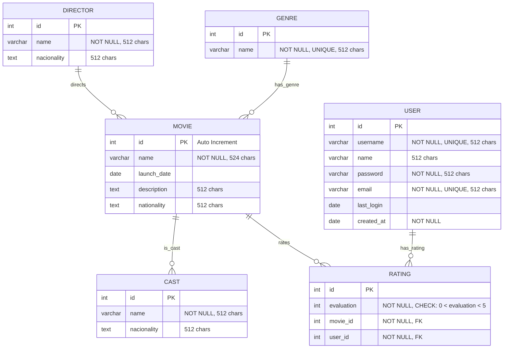

# Entity Relationship Diagram

This diagram represents the conceptual data model for the Movie Recommendation Platform.

## Entity Descriptions

### Movie
The central entity representing films in the platform. Contains basic information about movies including title, release date, description, and nationality.

### Director
Represents movie directors with their personal information and nationality.

### Genre
Classification system for movies. Each genre has a unique name.

### Cast
Represents actors and actresses who appear in movies, including their nationality information.

### Rating
Junction entity that connects users with movies through ratings. Contains evaluation scores with constraints (0 < evaluation < 5).

### User
Platform users who can rate movies. Contains authentication and profile information.

## Relationships

- **Director directs Movie** (1:N): A director can direct multiple movies, but each movie typically has one primary director
- **Genre has_genre Movie** (M:N): Movies can belong to multiple genres, and genres can apply to multiple movies
- **Movie is_cast Cast** (M:N): Movies can have multiple cast members, and cast members can appear in multiple movies
- **Movie rates Rating** (1:N): A movie can have multiple ratings from different users
- **User has_rating Rating** (1:N): A user can rate multiple movies

## Business Rules

1. Movie names are required and limited to 524 characters
2. Genre names must be unique across the system
3. User usernames and emails must be unique
4. Ratings must be between 0 and 5 (exclusive bounds)
5. Users must have a password and email for authentication
6. Creation timestamp is mandatory for user accounts